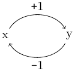
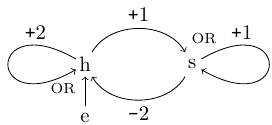
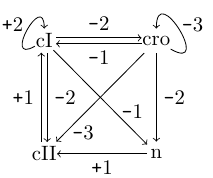

# Application

Various biological processes which exhibit multi-stationary or oscillatory behaviour are modelled via *feedback loops*. These loops constitute ubiquitous control mechanisms expressing that a change in the value of some biological variable, e.g., the concentration of an amino acid, results in a (re-)adjustment of its value. A common example is homeostasis, where the production of, e.g., an amino acid is regulated based on its current concen- tration. If its concentration is initially high, but decreasing, then its production is initially inhibited and later activated, once its concentration levels fall below a threshold. As a result, the concentration of the amino acid oscillates around a specified value.

Our formalisation of biological feedback loops follows the work of [Srinivasan et al.](https://link.springer.com/article/10.1007/s10994-021-06038-y), which models such loops by combining an Event Calculus dialect with the Kinetic Logic, i.e., a representation of delayed changes in biological variables through asynchronous automata. The event description for biological feedback loops we provide is a translate of the one presented by Srinivasan et al., which is suitable for run-time reasoning with RTEC. 

Our event description models the following three feedback loops. Refer to the work of Srinivasan for a thorough description of these loops.

   

The task of RTEC in this application is to compute the values of all variables in a loop at each time-point. These values depend only on the initial values of the variables in the loop and the temporal length of their delayed value changes. Therefore, there are no input data streams in this application.

# Directory Structure
- /results. Directory of the execution logs.
- /resources. Original and compiled patterns along with declarations and auxiliary domain knowledge.

# Execution Instructions

1. [Requirements](../../docs/prolog-requirements.md)
2. [Running an Existing Application](../../docs/prolog-existing-apps.md)

